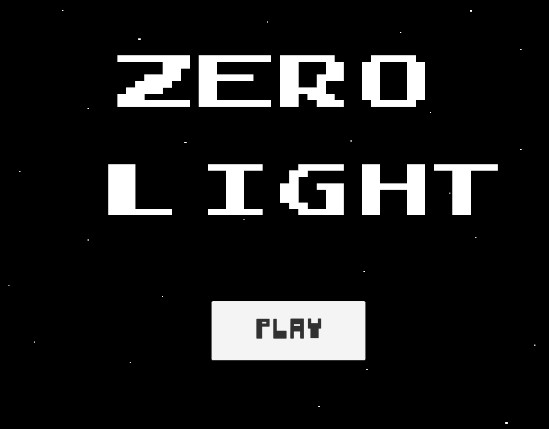
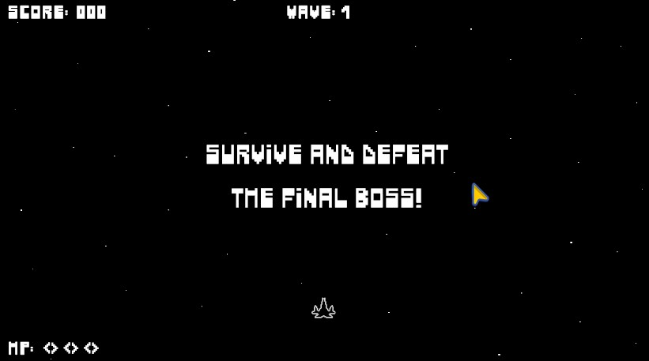
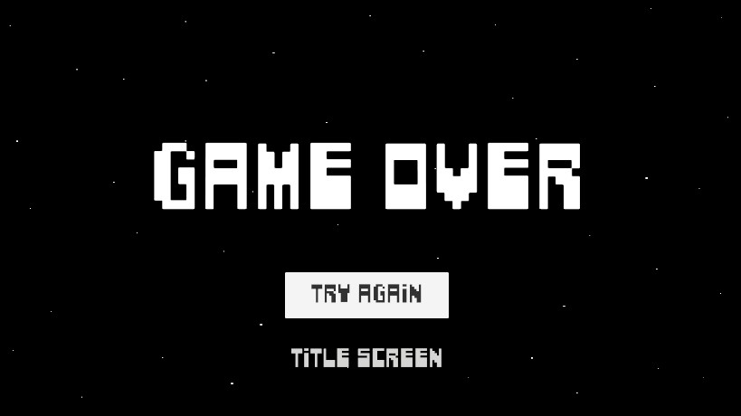
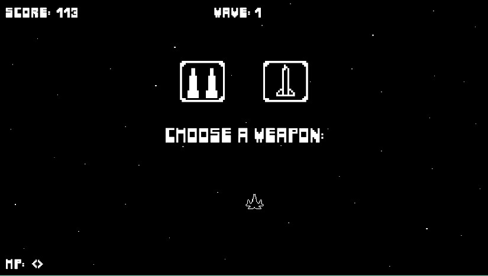
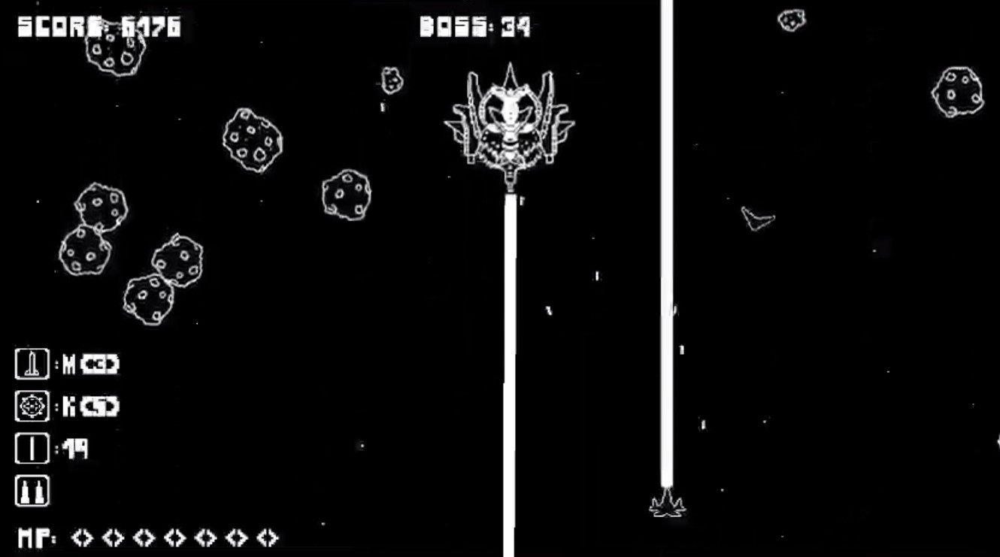
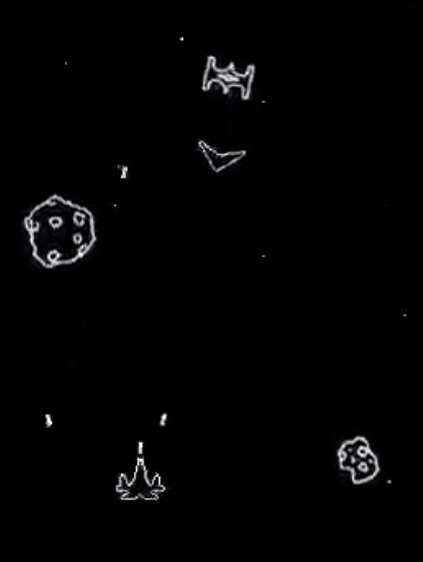
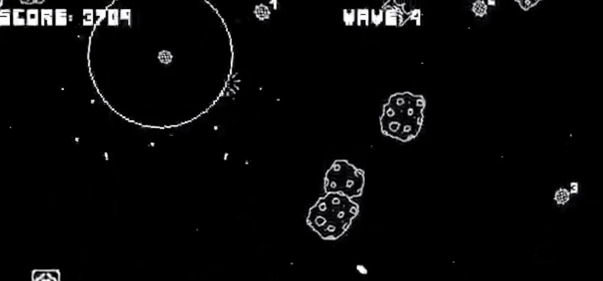

# ZERO LIGHT

A simple Unity top-down WASD + SPACE + JKL space shooter.

## Overview
- Fast-paced, 10–15 minute rounds
- Wave-based spacecraft enemies with final boss! ...and asteroids ~
- Score, health, ammo, and power-ups drive player progression
- Mimics spacecraft movement (this is not the typical space shooter you may have experienced)
- Focuses more on dodging and maneuvering your spacecraft, rather than simply spamming shots at enemies
- Random weapons are offered between waves, affecting your strategy for the next wave
- Easy to learn, hard to master
- You'll ENJOY this!

## Gallery

*Caption: title screen. title + space + play*

*Caption: intro scene you will see in the beginning*

*Caption: game over screen, but you can retry! and get better!*

*Caption: choose a random weapon depends on which powerups you've got for better synergies.*

*Caption: boss battle scene. Play the game you will see more its interesting interactions!*

*Caption: some gameplay scenes*

## Credits

- **Developer:** Me
- **Game Engine:** Unity
- **Instructor:** Mr. Emil

